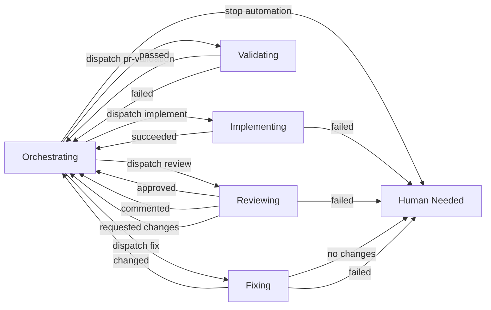

# Draft Orchestrator State Machine

## Intent

Capture the current desired controller shape in one temporary roadmap artifact before hardening it into the blueprint.

This file is a working note, not yet an executable work unit.

## Scope

- Describe the central-controller interaction between `implement`, `pr-validation`, `review`, `fix`, and `human-needed`.
- Keep the state set intentionally small.
- Keep validation as PR-attached checks, not comment-only reporting.
- Treat this file as a staging area for later promotion into `AGENT_BLUEPRINT.md`.

## Current Working Diagram

## Transition Table

| Signal Into Orchestrator | Guards | Orchestrator Action | Next State |
| --- | --- | --- | --- |
| `implement` succeeded | PR exists and is open | dispatch `pr-validation` | `Validating` |
| `implement` failed | always | stop automation, mark for human attention | `Human Needed` |
| `pr-validation` passed | latest reviewed head SHA does not already have a completed autonomous review | dispatch `review` | `Reviewing` |
| `pr-validation` failed | `workflow-owned` and `autofix-enabled` are present, stop labels are absent, fix budget remains | dispatch `fix` | `Fixing` |
| `pr-validation` failed | fix budget exhausted, latest fix made no changes, or stop labels are present | stop automation, mark for human attention | `Human Needed` |
| `review` approved | latest validation for the same head SHA passed | stop automation, mark PR ready for human decision | `Human Needed` |
| `review` commented | latest validation for the same head SHA passed and no blocking follow-up is needed | stop automation, mark PR ready for human decision | `Human Needed` |
| `review` requested changes | `workflow-owned` and `autofix-enabled` are present, stop labels are absent, fix budget remains | dispatch `fix` | `Fixing` |
| `review` requested changes | fix budget exhausted or stop labels are present | stop automation, mark for human attention | `Human Needed` |
| `review` failed | always | stop automation, mark for human attention | `Human Needed` |
| `fix` changed code | PR still open | dispatch `pr-validation` | `Validating` |
| `fix` reported no changes | always | stop automation, mark for human attention | `Human Needed` |
| `fix` failed | always | stop automation, mark for human attention | `Human Needed` |

## Policy Notes

- The orchestrator should be the only workflow that decides what stage runs next.
- Worker workflows should emit outcomes and artifacts, then hand control back to the orchestrator.
- Validation should remain PR-attached checks/check-runs; orchestration comments should stay supplemental.
- Labels should remain hard gates, not advisory hints.
- Review should become another event source into the controller, not a sidecar stage that independently decides to trigger `fix`.

## Open Questions

- Should `Ready for human` become an explicit state distinct from `Human Needed`, or is one terminal human-facing stop state enough for the first controller version?
- Should validation always be explicitly dispatched by the orchestrator, even when normal PR events would also run it?
- Should the orchestrator suppress duplicate review runs for a head SHA that already has a successful review artifact?
- Should stop-state labeling use both `human-needed` and `autofix-disabled`, or collapse to one label?

## Promotion Criteria

- The transition table is stable enough to implement without guessing.
- The orchestrator owns stage sequencing in practice, not just on paper.
- The same rules are ready to be described as blueprint guidance rather than repo-local experimentation.
